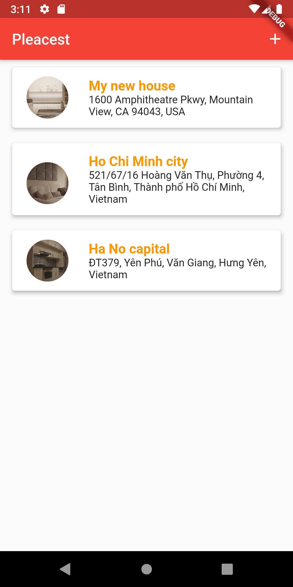

#  Placest

## [Live Demo](https://www.youtube.com/watch?v=WIwrm7RfrpU)

## What is Pleacest?
A mobile chat application that helps you to store places' information.

## Technology
- Frontend
  - Flutter - Google's UI toolkit
  - Provider - State Management
- Backend
  - Google Cloud Platform - Google Map API
  - SQLite - Data Storage

## Some review images



## Getting Started

This project is a starting point for a Flutter application. Before jump into run this application, you need to:
- Create `.env` file that have properties like `.env.example` file. Then replace `GOOGLE_API_KEY` value with your Google API key.
- Setup Google Map API key into Android and IOS folder (The ways to do it change very frequently, so the best way is search for it on Google which always be updated)

After 2 above steps, run command
```
flutter run
```

# License & copyright

© Kirin Tran, FPT University TP.HCM
Licensed under the [MIT LICENSE](LICENSE).